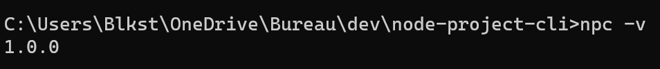

# node-project-cli

Un CLI fait avec Node.js pour générer des fichiers et des dossiers

## Pré requis

- Avoir Node.js **14.0, 16.15 ou supérieur** installé
- Avoir npm **6.14, 7.0, 8.0 ou supérieur** installé

## Installation

Pour installer le projet localement, il faudra :

1) cloner le projet avec la commande `git clone https://github.com/EvensPompe/node-project-cli.git`.
2) créer un lien symbolique globalement (installe aussi les dépendances dans le même temps) en exécutant la commande `npm link npc`. Pour plus d'infomation sur la commande, <a href="https://docs.npmjs.com/cli/v8/commands/npm-link" target="_blank" >cliquer ici</a>.
3) vérifier l'installation et la version en `npc -v` ou `npc --version`

*Si vous voulez retirer le lien symbolique, exécuter la commande* `npm unlink npc`.
